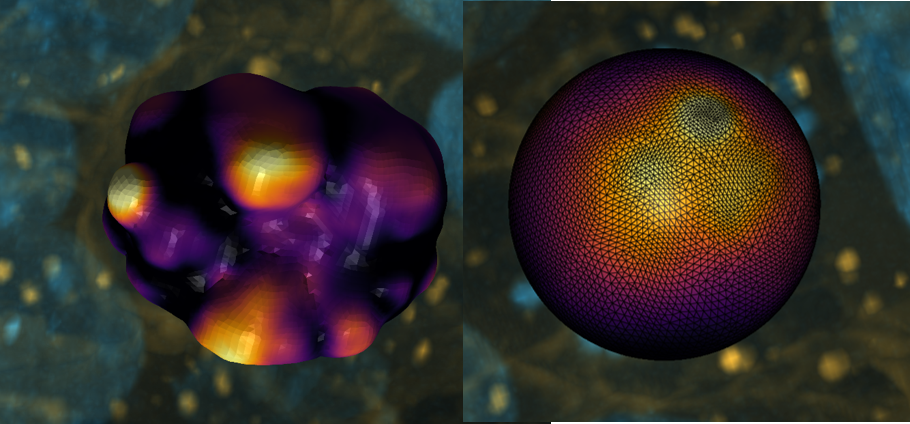

# napari-shape-odyssey

Analyze shapes of meshes: This plugin provides advanced measures of shape for meshes. It is based largely on the following libraries and tools:

* [PyFM](https:/github.com/robinmagnet/pyfm)
* [boundary-first-flattening](https://github.com/GeometryCollective/boundary-first-flattening)

## Shape analysis

This plugin provides Laplace spectra ([Reuter, Wolter, Peinecke (2005)](https://dl.acm.org/doi/abs/10.1145/1060244.1060256)), heat kernel signatures ([Bronstein & Kokkinos (2010)](https://ieeexplore.ieee.org/abstract/document/5539838/)) & wave kernel signatures ([Audrey, Schlickewei, Cremers et al.](https://ieeexplore.ieee.org/abstract/document/6130444)).

**Laplace spectra** can be imagined to be the equivalent of resonance modes on the surface of a mesh. The resonance and the resonance modes can, for typical objects, look like this:

** Heat kernel signatures**: Heat dissipation on a mesh depends on local geometry. You can use the heat kernel signature to easily generate a large number of local features of shape

** Intensity expansion **: Approximate intensity on the surface of a mesh using a Laplace-Beltrami-Operator eigenvector basis. This allows to obtain a measurement for how local or global the signal on the surface of a mesh is.

## Unwrapping

This plugin provides a number of methods to unwrap a mesh into basic shapes such as spheres or disks. The method relies on [boundary-first flattening](https://github.com/GeometryCollective/boundary-first-flattening) - currently it's only available on Windows.

## Installation

You can install `napari-shape-odyssey` via [pip]:

´´´bash
    pip install napari-shape-odyssey
    napari-skimage-regionprops @ git+https://github.com/jo-mueller/napari-skimage-regionprops.git
    pyFM @ git+https://github.com/RobinMagnet/pyFM.git
´´´